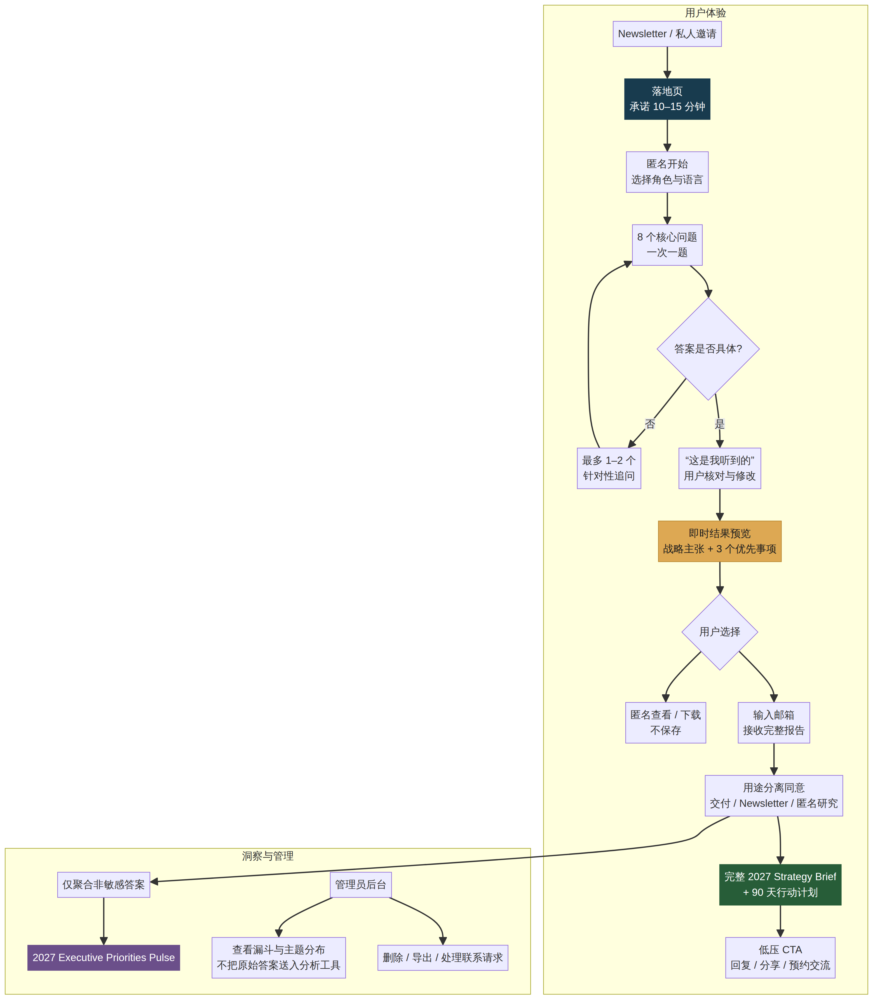

# 2027 Strategy Copilot：产品与增长蓝图

**作者：Manus AI**  
**日期：2026-09-07**

## 一、结论先行

这个工具**值得做**，但不建议把附件里的旧 Prompt 原样搬到网页，也不建议让用户一进来先交邮箱。

最合适的产品不是“AI 帮你写一份 2027 计划”，而是一个 **10–15 分钟的 Executive Strategy Sprint**：AI 像战略顾问一样一次问一个问题，主动追问模糊点、指出矛盾、要求用户做选择，最后产出一份可以直接拿去参加年度规划会的 **一页战略摘要、优先事项组合、90 天行动计划和管理层讨论问题**。

建议采用以下核心原则：

1. **先给价值，再要邮箱。** 用户完成主要问题后，先看到战略主张和三个优先事项的预览；只有在希望保存、接收完整版或继续优化时才输入邮箱。
2. **把“交付报告”“订阅 newsletter”“参与匿名研究”拆成三个独立选择。** 不要用一个勾选框同时获取全部权限。
3. **默认不要求公司名，也明确提醒不要输入机密信息。** 对 Integrated Resort（综合度假村）和 IT 高管尤其要避免收集宾客个人信息、博彩数据、系统拓扑、漏洞、事故细节和未公开财务信息。
4. **先做可控的专用策略引擎，再接完整 Manus Agent。** 第一版用结构化问答与受控 AI 生成，质量、速度和成本更容易管理；需要外部研究、上传文档分析或深度迭代时，再升级到 Manus API。
5. **把 newsletter 做成产品体验的入口，而不是一次营销群发。** 核心信息应是：“我做了一个能帮助你做出取舍的 AI Strategy Copilot”，而不是“我做了一个收集 2027 意向的 survey”。

> **一句话产品定位：** 用 10–15 分钟，把脑中的 2027 想法，变成一份经得起管理层追问的战略选择与 90 天行动计划。

---

## 二、对原 Prompt 的评估

附件实际是一套 2024 年营销 Prompt 合集。最有价值的部分不是具体的 persona、email、AIDA 或营销计划模板，而是两种交互机制：

- **Prompt Engineer 循环：** 用户输入背景，AI 重写和追问，双方持续迭代，直到用户确认完成。
- **Persona Consultant 逐题访谈：** AI 一次问一个问题，在全部回答完成后再生成结构化结果。

这两种机制非常适合网页产品，因为它们降低了“空白输入框焦虑”，同时让最终输出更贴近用户情境。附件的六步结构也说明，先收集上下文，再生成细分、信息框架、方案和行动清单，比一次性要求 AI 写完整计划更可靠。

但是，如果面向 CTO、Director 和 EMBA executive，原 Prompt 有五个明显不足。

| 原设计特点 | 对高管用户的问题 | 应如何升级 |
|---|---|---|
| 重点是 persona、社交媒体和营销文案 | 与年度 IT／业务战略规划不匹配 | 改为战略选择、资源配置、能力差距、风险和执行节奏 |
| 固定问 10 题 | 不会根据角色、行业和回答质量调整 | 使用核心问题加条件追问，控制在 8–12 次交互内 |
| 只收集信息，不挑战假设 | 容易生成“正确但没用”的套话 | 要求 AI 指出矛盾、缺失证据和被回避的取舍 |
| 最后输出传统 SWOT 和长计划 | SWOT 容易罗列事实，缺少选择 | 以 Rumelt 的诊断—关键障碍—指导方针—协调行动为主干，再连接战略选择、假设验证与执行指标 |
| 没有隐私和数据边界 | 高管不会愿意提交真实敏感信息 | 设计匿名模式、分层同意、保留期限和删除机制 |

经过对八套经典战略与经营框架的进一步研究，建议采用 **Richard Rumelt 的《Good Strategy/Bad Strategy》与《The Crux》作为唯一主干**，用 A.G. Lafley 与 Roger L. Martin 的 Playing to Win 规格化战略选择，用 Discovery-Driven Planning 管理假设和阶段投入，再用 Balanced Scorecard / Strategy Maps 连接指标与执行。这样可以避免把工具做成“框架拼盘”：Rumelt 决定问题是什么，其他框架分别回答如何选择、如何验证和如何执行。完整依据、版权边界、信誉文案和升级版访谈结构见 [《2027 Strategy Copilot：权威方法论研究与产品化设计》](./2027-Strategy-Copilot-Methodology.md)。

对外应表述为“**采用自主设计的方法，并参考公开发表的战略思想**”，而不是“AI 训练自某本书”。模型能力、方法论结构和用户事实是三件不同的事；只有这种透明表达，才真正有助于建立 reputation。

---

## 三、目标用户与产品切入点

### 3.1 核心用户

| 用户群 | 年度规划中的真实任务 | 工具应交付的价值 |
|---|---|---|
| Integrated Resort / Hospitality CTO、CIO | 在 AI、数据、网络安全、客户体验、核心系统现代化、合规和成本之间做取舍 | 将技术议题翻译成业务成果、风险和投资优先级 |
| IT Director / Digital Director | 把项目清单升级为有逻辑、有负责人、有指标的年度路线图 | 形成季度路线图、依赖关系和第一季度行动 |
| Business Unit Leader / EMBA executive | 澄清增长重点、能力短板与跨部门协同 | 形成战略主张、三项优先事项和管理层讨论题 |
| 创业者和中小企业负责人 | 从许多机会中选择少数关键赌注 | 形成取舍、资源假设和验证计划 |

近期 APAC CIO 议题强调 AI 投资价值、风险治理、数据责任、网络安全和用数字管理 IT；其中真正的管理要求已经从“是否采用 AI”转向“是否产生可衡量的业务价值”。[2] 酒店业 2027 年规划也不应只等于预算，而要把资本计划、商业策略和运营预算连接起来。[3] 这些趋势说明，你的工具应把 **技术、商业、风险和财务** 放在同一张战略图上。

### 3.2 产品命名建议

主名称可以保持行业中性，以便覆盖客户和 EMBA 同学；副标题再强化你的专长。

| 类型 | 建议名称 | 适用方式 |
|---|---|---|
| 推荐工作名 | **2027 Strategy Copilot** | 清楚、专业、便于英文传播 |
| 中文名 | **2027 战略共创助手** | 比“战略生成器”更有顾问感 |
| Newsletter 活动名 | **2027 Executive Planning Sprint** | 强调时间短、适合高管 |
| IR 定向版本 | **2027 IR Technology Strategy Sprint** | 用于定向给 Integrated Resort 客户的链接 |

不要使用“Business Plan Generator”作为主名。高管会把它理解成模板生成器，而不是思考工具。

---

## 四、核心体验设计



### 4.1 推荐用户旅程

| 阶段 | 用户看到什么 | 产品目的 |
|---|---|---|
| 1. Landing Page | 价值承诺、预计时间、样例输出、隐私说明 | 建立信任，不先要求注册 |
| 2. Choose Your Lens | Technology & Digital、Business / BU、Personal Leadership；选择语言 | 让同一个引擎适配不同人群 |
| 3. Guided Interview | 一次一题；可语音输入；显示进度；每题可跳过 | 降低认知负担，获得结构化信息 |
| 4. Smart Follow-up | 只对模糊、矛盾或缺少指标的回答追问 | 展现“像顾问”而不是“像表单” |
| 5. Reflection Gate | “这是我听到的”：展示关键事实、假设和矛盾，请用户修改 | 避免 AI 在错误前提上生成漂亮报告 |
| 6. Instant Preview | 免费展示战略主张、三个优先事项、一个关键风险 | 在索取邮箱前证明价值 |
| 7. Delivery Choice | 匿名浏览；输入邮箱接收完整报告；保存进度 | 让邮箱成为服务功能，而不是入场费 |
| 8. Full Brief | 一页摘要、选择地图、路线图、指标和讨论题 | 产生可带走、可转发的成果 |
| 9. Follow-up | 一封交付邮件；可选 newsletter；低压交流邀请 | 建立持续关系和 BD 机会 |

对话式“一次一题”表单通常比僵硬的大表单更像交流，并可配合不同题型、移动端和实时分析提升完成体验。[4] 但这里不应机械模仿 Typeform。最重要的差异是：**每一题都根据前文回答而变化，同时总时长仍然可预测。**

### 4.2 Landing Page 的核心文案

**Headline**  
2027 的计划，不应该从项目清单开始。

**Subheadline**  
用 10–15 分钟，让 AI 以战略顾问的方式追问你，帮助你把机会、取舍、能力和执行路径整理成一份 2027 Strategy Brief。

**Three proof points**

- 不是通用模板：问题会根据你的角色、行业和回答变化。
- 不是越长越好：最后只保留三项真正重要的战略优先事项。
- 先匿名体验：无需填写公司名；完成后再决定是否用邮箱接收完整版。

**CTA**  
开始我的 2027 Strategy Sprint

**Trust copy**  
请不要输入客户个人资料、系统密码、漏洞细节、未公开财务数据或其他受限信息。你可以使用公司别名。原始回答默认不用于公开研究；任何额外用途都会单独征得你的同意。

---

## 五、访谈问题设计

### 5.1 问题结构

建议使用 **8 个核心问题 + 最多 4 个条件追问**。每个问题都应允许“跳过”“给我一个例子”和“用语音回答”。

| 阶段 | 核心问题 | AI 的判断任务 |
|---|---|---|
| Context | 你正在为谁、哪个业务范围制定 2027 计划？你的角色是什么？ | 选择 IT、业务或个人领导力 lens |
| Outcome | 到 2027 年底，如果只能用一个 headline 和两个数字证明成功，它们是什么？ | 将愿望转为成果和衡量方式 |
| Change | 与 2026 相比，外部环境、客户、竞争、技术或监管有什么变化，迫使你改变？ | 区分趋势、事实与假设 |
| Arena | 2027 最值得集中的两个机会领域是什么？哪些领域明确不优先？ | 强迫做 where-to-play 取舍 |
| Advantage | 在这些领域，你凭什么能赢或创造独特价值？ | 找出差异化逻辑和证据 |
| Portfolio | 现有项目中，哪些应加码、维持、停止或延后？ | 从“加项目”转为资源再配置 |
| Capability & Risk | 哪三项能力、数据、人才、流程或治理条件最可能决定成败？最大的下行风险是什么？ | 识别能力缺口、依赖和风险 |
| Execution | 未来 90 天必须完成什么，谁负责，用什么领先指标判断方向正确？ | 连接年度战略与近期执行 |

### 5.2 Integrated Resort / IT 条件模块

当用户选择 Technology & Digital 且行业为 Integrated Resort / Hospitality 时，系统可在以下主题中动态追加一到两题，而不是全部询问：

- **Guest and player experience：** 计划如何连接住宿、餐饮、娱乐、忠诚度、博彩和现场服务体验？
- **Data and AI value：** 哪个价值流最适合 AI，收益如何量化，谁拥有业务结果？
- **Cyber and resilience：** 哪个关键运营场景最不能中断，恢复目标和人工兜底是什么？
- **Core modernization：** 哪些遗留系统或集成正在限制速度、成本透明度或体验一致性？
- **Governance and compliance：** 数据主责、模型治理、供应商风险和监管责任是否明确？
- **Capital and operating model：** 一项技术投资如何同时影响资产、商业策略和运营预算？

### 5.3 追问规则

系统只在下列情况追问，而且每个核心问题最多追问一次：

1. 回答只有愿望，没有可观察成果。
2. 用户列出超过三个“最高优先级”。
3. 选择与资源或能力明显矛盾。
4. 指标是活动量而非业务结果，例如“上线 10 个 AI 项目”。
5. 用户没有说明停止、延后或不做什么。
6. 用户写入疑似敏感信息时，系统先提醒其抽象化或删除。

**好的追问示例：**

> 你列出了六项“最高优先级”。如果预算不增加、团队规模不变，哪两项仍必须保留？另外四项中哪一项可以明确停止？

**不好的追问示例：**

> 请提供更多信息。

---

## 六、最终交付物设计

不要一上来生成 20 页报告。默认输出应分成两层。

### 6.1 即时预览

完成主要问题后，在邮箱之前显示：

1. **一句话战略主张**；
2. **三个 2027 优先事项**；
3. **一个最关键的战略取舍**；
4. **一个需要管理层讨论的矛盾或风险**。

这部分必须足够有价值，让用户知道完整报告值得接收。

### 6.2 完整 2027 Strategy Brief

| 模块 | 输出内容 |
|---|---|
| Executive Snapshot | 战略主张、范围、成功定义和两项 North Star 指标 |
| Strategic Context | 已知事实、用户假设、不确定性和外部变化 |
| Choice Cascade | Winning aspiration、where to play、how to win、关键能力、管理系统 |
| Priority Portfolio | 三项优先事项；每项包含业务价值、理由、负责人、投入和依赖 |
| Stop / Defer List | 明确列出停止、延后或不进入 2027 的事项 |
| Risk & Pre-mortem | 三项失败情景、早期预警信号和缓解动作 |
| 90-Day Plan | 未来 13 周的关键里程碑、负责人和验收标准 |
| 2027 Roadmap | Q1–Q4 结果导向路线图，不做伪精确日期 |
| Scorecard | 领先指标、滞后指标、数据来源、评审节奏 |
| Executive Conversation Guide | 向 CEO / CFO / Board 讲述该战略的 5 个 talking points 和 5 个 tough questions |

不建议输出一个看似精确的“78/100 战略分数”。高管更需要透明的判断。可以提供一个 **Readiness Snapshot**，对“选择清晰度、价值证据、能力准备、执行责任、风险韧性”给出红黄绿状态，并逐项说明依据和缺失信息。

---

## 七、邮箱、隐私与“2027 Pulse”设计

### 7.1 是否应该一开始收邮箱？

**不应该强制。** 对熟人和客户，一开始就收邮箱会把“朋友分享的有用工具”变成“伪装成工具的 lead form”。更好的顺序是：

1. 匿名开始；
2. 完成访谈；
3. 看到有用的预览；
4. 再选择是否通过邮箱保存和接收完整报告。

可以在开始时提供一个**非强制选项**：“输入邮箱，以便跨设备保存进度。” 但“稍后继续”不应成为强制条件。

### 7.2 三种隐私模式

| 模式 | 默认行为 | 适合人群 |
|---|---|---|
| Private Session | 答案只在生成期间处理；不用于 pulse；会话和报告在明确期限后删除 | 对公司信息敏感的高管 |
| Save My Brief | 保存邮箱和报告，便于重新访问；显示明确保留期限和删除入口 | 希望后续继续修改的用户 |
| Contribute to 2027 Pulse | 只在独立同意后，将标准化、去标识的主题标签纳入汇总 | 愿意交换行业洞察的用户 |

官方隐私指导强调，个人数据应当与明确目的相关，只收集完成该目的所必需的内容，并在不再需要时删除。[5] 如果依赖用户同意，用户需要知道同意什么、用于什么目的，并可撤回；目的限定、存储期限和安全也应事先定义。[6] 即使你的初始受众大多是熟人，也应按这些原则设计。

### 7.3 同意文案应拆开

**必须项：报告交付**

> 我同意使用以上回答生成并发送我的 2027 Strategy Brief。查看隐私说明。

**可选项：newsletter**

> 我愿意接收 Craig 关于 AI、IT leadership 与 strategy 的后续 newsletter。可随时退订。

**可选项：匿名研究**

> 我同意将不含姓名、邮箱、公司名和自由文本原句的汇总标签，用于发布 2027 Executive Priorities Pulse。任何单独组织或个人都不会被识别。

营销平台本身也要求 lead form 提供隐私政策链接并说明收集信息的用途；额外用途应通过单独披露或复选框获得具体同意。[7]

### 7.4 2027 Executive Priorities Pulse

这个 survey 想法有价值，但应是**副产品，不是用户感受到的主要目的**。建议只汇总标准化字段，例如：

- 角色层级和宽泛行业；
- 2027 前三优先事项；
- 最大约束；
- AI 价值阶段；
- 风险关注点；
- 预算方向；
- 战略信心区间。

不要把自由文本原句直接放入分析库。先由 AI 归类为固定标签，再删除或隔离原文。发布时设置最低样本门槛，例如样本不足 20 人不做交叉切片，避免小群体被反向识别。最终报告可以成为下一期 newsletter 的高价值内容：**“2027 APAC Technology & Executive Priorities Pulse”**。

---

## 八、营销与 BD 设计

### 8.1 价值交换

用户愿意分享真实信息的前提不是“认识你”，而是四个信号同时成立：

| 信号 | 产品中的表达 |
|---|---|
| 有即时价值 | 邮箱前可看到个性化预览 |
| 有控制权 | 匿名开始、可跳过、可删除、用途分开同意 |
| 有专业性 | 问题要求取舍、证据和指标，不只是生成漂亮文字 |
| 有适度回报 | 完整 brief、90 天计划、匿名同行基准和后续交流 |

### 8.2 CTA 梯度

不要把所有人都直接推向销售会议。按意愿设计三层 CTA：

1. **轻 CTA：** 把报告转发给一位管理层同事，邀请对方标注意见。
2. **中 CTA：** 回复邮件，告诉你其中哪一项最难做取舍。
3. **高意向 CTA：** 预约 25 分钟 Strategy Pressure Test，与用户一起挑战优先事项和假设。

### 8.3 BD 信号

只有用户明确同意后，后台才应显示以下非敏感信号：

- 用户是否进入预算或执行阶段；
- 优先事项类别；
- 预计启动季度；
- 是否需要跨部门 alignment；
- 是否主动要求 follow-up。

不要用敏感原文做隐形 lead scoring，也不要在跟进邮件中逐字复述用户的机密描述。这样既能保留 BD 价值，也不会破坏信任。

---

## 九、技术实施方案

这个项目包含公开网页、动态问答、AI 生成、数据库、邮件和管理员分析，因此应使用有后端的全栈网站，而不是纯静态页面。API 密钥必须只存放在服务器端。

### 9.1 三个可行路径

| Approach | Tradeoffs | Cost | Setup Complexity |
|---|---|---|---|
| 轻量验证：品牌落地页 + 对话式表单 + 可复制 Prompt | 上线最快；可以验证点击率和完成率；但个性化弱，报告生成和邮件交付较手动 | 低 | 低，约 1–3 天 |
| 专用全栈 MVP：网页问答 + 数据库 + 受控 LLM + 事务邮件 | 体验和数据边界最好；可生成结构化结果；需要搭建后台、邮件域名和隐私页面 | 按实际使用量；可从小规模开始 | 中，约 2–4 周做成可公开测试版本 |
| 深度 Agent 版：网页 + Manus API 多轮任务 + 外部研究/文件分析 | 能做深度研究和真正 agentic 的报告；但延迟、运行消耗、错误处理和异步状态更复杂 | 相对更高且波动更大 | 高，适合作为验证后的高级模式 |

**选择标准：** 如果目标是先验证朋友和客户是否愿意完成并分享，选择第一种；如果目标是把它作为你的长期品牌资产和获客入口，选择第二种；如果核心卖点必须包含外部研究、上传年度报告、动态查证和深度咨询，才使用第三种。

### 9.2 推荐的分层架构

```text
Public Website
  ├─ Landing page / trust contract
  ├─ Guided interview / local draft save
  ├─ Preview and consent
  └─ Report viewer / delete request

Application Backend
  ├─ Session state machine
  ├─ Prompt orchestration and safety filter
  ├─ Structured-output validation
  ├─ Consent ledger
  ├─ Report rendering
  └─ Transactional email

Data Layer
  ├─ Contact identity (separate table)
  ├─ Strategy session and answers
  ├─ Generated report versions
  ├─ Aggregated pulse tags
  └─ Audit / deletion timestamps

Optional Advanced Layer
  └─ Manus API task + webhook for deep research and document analysis
```

对于第一版，建议使用专用 LLM 的结构化 JSON 输出，以固定 schema 返回战略摘要、优先事项、风险、路线图和指标。完整 Manus API 适合后续的“Deep Research”按钮，因为其任务是异步运行，并可通过 webhook 返回结果；结构化输出可以确保应用收到符合 schema 的 JSON。[8] [9]

不要让 Agent 直接通过你的个人 Gmail connector 自动发送所有结果。更稳妥的方式是由网站后端使用你域名下的事务邮件服务发出报告；Manus 负责分析，邮件服务负责可靠交付。这样也更容易做退信、退订、模板和日志管理。

### 9.3 建议数据模型

| 表 | 关键字段 | 隐私要求 |
|---|---|---|
| contacts | email、name/alias、locale、newsletter consent | 与回答内容分表；加密或受限访问 |
| sessions | session ID、lens、role band、industry band、status、expiry | 匿名 session 也可存在，但不要存不必要的指纹 |
| responses | question ID、answer、sensitivity flag、created time | 默认短期保留；支持用户删除 |
| reports | version、structured JSON、rendered HTML/PDF link | 显示 AI 假设和生成时间 |
| consents | purpose、version、granted time、withdrawn time | 每个用途独立记录 |
| pulse_tags | standardized topic、priority rank、confidence band | 不含邮箱、姓名、公司名和自由文本 |

### 9.4 安全和质量控制

- 服务端密钥管理；浏览器中绝不出现 AI 或邮件 API key。
- 提交前做敏感信息提醒和轻量检测。
- 原始回答、联系人信息、聚合标签分离存储。
- 每个报告标注“事实 / 用户判断 / AI 推断 / 待验证”。
- 外部事实必须附来源；没有联网研究时不得伪造行业数据。
- 报告允许用户逐段编辑，再导出或发送。
- 默认设定数据保留期限，并提供邮件内删除链接。
- 管理分析只记录步骤和类别，不把原始答案发送到普通网站分析工具。

---

## 十、AI Prompt 与状态机设计

### 10.1 系统 Prompt 核心版本

以下内容适合成为服务器端策略引擎的基础 Prompt，而不是直接展示给终端用户。

```text
You are a senior strategy facilitator for executives planning for 2027.
Your job is not to write a long generic plan. Your job is to help the user make
clear, connected choices and convert them into an executable strategy brief.

Principles:
1. Ask one question at a time.
2. Never ask for information already provided.
3. Use at most 8 core questions and 4 conditional follow-ups.
4. Acknowledge each answer in one concise sentence, then ask the next question.
5. Follow up only when an answer is vague, contradictory, lacks a measurable
   outcome, contains too many priorities, or avoids a trade-off.
6. Ask what the user will stop, defer, or deliberately not do.
7. Separate facts, user assumptions, AI inferences, and unknowns.
8. Do not invent market data, financial facts, benchmarks, or regulatory claims.
9. Never request passwords, personal guest/customer data, vulnerability details,
   incident evidence, or unpublished restricted information. If such content appears,
   ask the user to remove or abstract it.
10. Support Technology & Digital, Business / BU, and Personal Leadership lenses.
11. Respond in the user's selected language.
12. Before finalizing, show a concise “What I heard” summary and allow correction.

Strategy logic:
- Winning aspiration
- Where to play
- How to win
- Required capabilities
- Management systems
- Priority portfolio: accelerate, maintain, stop/defer, hedge
- 90-day execution and 2027 quarterly outcomes
- Leading and lagging measures
- Pre-mortem risks and early warning signals

Conversation states:
A. Context
B. Desired outcome
C. External change and assumptions
D. Strategic arenas and explicit exclusions
E. Advantage / how to win
F. Portfolio choices
G. Capabilities, dependencies and risks
H. 90-day execution and measures
I. Reflection and correction
J. Preview
K. Final structured brief

When generating the final answer, return valid structured data matching the
application schema. Keep recommendations traceable to the user's own answers.
If evidence is missing, state “needs validation” rather than filling the gap.
```

### 10.2 用户自助的 Prompt-only 备选版

如果暂时不开发网站，可以把下面这一版放进 newsletter，让收件人复制到任意 AI 工具中使用。它也可以作为产品的 Alpha 验证。

```text
请担任我的 2027 战略顾问。你的目标不是快速替我写一份长计划，而是通过逐题访谈，帮助我做出清晰、相互一致、可执行的战略选择。

工作方式：
1. 先询问我选择哪个规划视角：A. Technology & Digital；B. Business / Business Unit；C. Personal Leadership。
2. 一次只问一个问题。总共最多问 8 个核心问题，以及最多 4 个有必要的追问。
3. 不要重复询问我已经回答的信息。每次先用一句话确认你理解到的重点，再问下一题。
4. 当我的回答太抽象、没有指标、列出太多优先事项、回避取舍或前后矛盾时，才进行一次针对性追问。
5. 必须追问我：哪些事情会加码，哪些维持，哪些停止或延后；如果资源不增加，我会保留哪三项优先事项。
6. 不要索取或鼓励我提供密码、客户个人资料、系统漏洞细节、事故证据或未公开的敏感财务信息。如我无意中提供，请提醒我删除或抽象化。
7. 把事实、我的假设、你的推断和仍需验证的信息分开。
8. 不得编造市场数据、财务数据、案例或来源。
9. 在最终生成前，先给我一份“这是我听到的”摘要，包括目标、选择、假设、矛盾和缺失信息，让我修正。只有我确认后才完成报告。

核心问题应覆盖：
- 到 2027 年底，希望实现的一个 headline 和两个可衡量结果；
- 相比 2026 年，哪些客户、竞争、技术、监管或组织变化迫使我改变；
- 我们选择在哪里投入，以及明确不在哪里投入；
- 我们凭什么能赢或创造独特价值；
- 现有项目中哪些加码、维持、停止或延后；
- 需要补齐的关键能力、数据、人才、流程和治理；
- 最大失败风险、早期预警信号和缓解措施；
- 未来 90 天的负责人、里程碑和领先指标。

最终请输出：
1. 一句话战略主张；
2. Executive Snapshot；
3. Winning aspiration / Where to play / How to win / Capabilities / Management systems；
4. 三项战略优先事项，每项包含业务价值、负责人、投入、依赖和验收标准；
5. Stop / Defer List；
6. 三项 pre-mortem 风险和预警信号；
7. 90 天行动计划；
8. Q1–Q4 结果导向路线图；
9. 领先与滞后指标；
10. 我应带进管理层会议的 5 个 tough questions。

现在只问第一个问题，不要提前生成计划。
```

---

## 十一、MVP 范围与发布节奏

### Phase 0：Concierge Alpha

先邀请 8–12 位你熟悉的 CTO、Director 和 EMBA 同学。使用网页原型或 Prompt-only 版本完成访谈。你人工检查每份报告，并做 15 分钟回访。重点验证的不是“AI 写得好不好”，而是：

- 问题是否迫使他们做了真实取舍；
- 10–15 分钟是否可接受；
- 哪一页最愿意带进 strategy review；
- 他们在什么时候开始担心数据；
- 看到预览后是否愿意留下邮箱；
- 是否愿意转发给同事。

### Phase 1：Private Beta

完成以下最小功能：Landing Page、三种 lens、逐题问答、智能追问、自动保存、反思确认、预览、邮箱交付、独立同意、完整报告、删除入口和基础后台。

### Phase 2：Newsletter Launch

给不同受众使用不同入口和文案：

- CTO / CIO：强调 AI value、risk、data、cyber 和 IT financial discipline。
- Integrated Resort：强调 guest experience、resilience、cross-property data 和 capital / operations alignment。
- EMBA executive：强调战略取舍、资源集中和管理层 alignment。

### Phase 3：Insight Loop

当有足够且明确同意的数据后，发布第一份匿名 Pulse。然后把 Pulse 的同行洞察反哺工具，让后续用户看到“你的优先事项与同类高管相比处于什么位置”。不要在样本很小时制造伪基准。

### Phase 4：Deep Strategy Mode

增加上传材料、外部研究、多人协作、版本对比和 Manus API 深度 Agent。这个阶段才值得让系统读取年度报告、战略文件或其他授权资料。

---

## 十二、成功指标

这些不是行业 benchmark，而是建议你在 Beta 阶段使用的**工作目标**。

| 漏斗阶段 | 指标 | Beta 工作目标 |
|---|---|---|
| Landing | CTA 点击率 | 按来源和人群分层观察，不先设虚荣目标 |
| Activation | 开始后完成第 3 题 | ≥ 65% |
| Completion | 到达预览 | ≥ 45% |
| Value | 报告有用度 4–5 / 5 | ≥ 70% 的完成用户 |
| Capture | 看过预览后选择接收完整版 | ≥ 35% |
| Trust | 选择匿名模式仍完成 | 单独观察，不视为低质量 lead |
| Engagement | 转发、回复或再次打开报告 | ≥ 15% |
| BD | 主动要求交流或 pressure test | 5–10% 可作为早期健康信号 |
| Insight | 同意进入匿名 Pulse | 只做观察，不用强诱导提高 |

最重要的北极星指标不是邮箱数量，而是：

> **完成用户中，有多少人认为这份输出值得带进 2027 planning conversation。**

---

## 十三、Newsletter 首发文案

### Subject line A

在写 2027 计划前，先让 AI 追问你 10 分钟

### Subject line B

我做了一个 2027 Strategy Copilot，想请你试用

### Email body

Hi {{First Name}},

9 月通常是很多团队开始准备下一年度 business planning 和 strategy review 的时候。

我最近把自己做策略讨论时常用的一套提问方式，做成了一个小工具：**2027 Strategy Copilot**。

它不会一上来替你写一份很长的“标准答案”。它会像一个顾问一样，一次问一个问题，追问目标、取舍、能力、风险和 90 天行动。大约 10–15 分钟后，你会得到一份可以继续修改或带进管理层讨论的 2027 Strategy Brief。

你不需要填写公司名，也不应该输入任何机密信息。可以先匿名完成主要部分，看到结果预览后，再决定是否用邮箱接收完整版本。

**Try the 2027 Strategy Sprint → {{Link}}**

这是一个早期版本。如果你愿意，完成后直接回复我：哪一个问题最有帮助，哪一个问题最不自然。你的反馈会帮助我把它做得更像真正的 strategy conversation，而不是另一个 AI form。

Best,  
Craig

### 针对 CTO / Integrated Resort 的开头替换

> 2027 IT Strategy 很容易变成一张越来越长的项目清单。但真正困难的是：在 AI、data、cyber resilience、guest experience、core modernization 和 cost discipline 之间，决定什么必须先做，以及什么今年明确不做。

---

## 十四、主要风险与应对

| 风险 | 为什么会发生 | 应对方式 |
|---|---|---|
| 被认为是 lead capture trap | 开始即要求邮箱，或隐藏数据用途 | 匿名开始、邮箱后置、用途分开同意 |
| 输出过于通用 | 问题只收集目标，不要求证据和取舍 | 智能追问、Stop / Defer、反思确认 |
| 高管中途退出 | 流程太长、每题都要求写长文 | 8 个核心问题、选项加短答、语音输入、明确剩余时间 |
| 用户输入敏感资料 | 行业信息本身可能受限 | 显著提示、敏感信息检测、允许别名、短期保留 |
| 报告漂亮但不能执行 | 缺少 owner、指标和近期动作 | 强制输出 90 天计划、责任人与验收标准 |
| Survey 破坏信任 | 未清楚说明二次用途 | 独立 opt-in，只汇总标签，设置最低样本门槛 |
| 一开始就接完整 Agent 导致体验不稳 | 任务延迟、异步状态和异常路径更复杂 | 第一版采用受控结构化生成，Deep Mode 后置 |
| 与个人品牌脱节 | 工具像通用 SaaS，不像你的观点 | 在问题、样例和 newsletter 中体现“AI-first but choice-led”方法论 |

---

## 十五、最终建议

建议把这个项目作为一个**信任型产品**而不是一个普通 lead magnet。你的真正优势不是“会调用 AI”，而是你熟悉 IT、Integrated Resort 和高管对话，并能把 AI 变成一种更好的思考与沟通方式。

第一版最应证明三件事：

1. 用户愿意在不交邮箱的情况下开始；
2. 问题能帮助用户做出以前没有明确表达的取舍；
3. 用户看到预览后，愿意主动留下邮箱、转发报告或与你继续交流。

如果这三件事成立，再投入完整开发、Manus API 深度模式和行业 Pulse。这样既能展示你的 AI-first 形象，也能保住最重要的资产：**客户对你的判断力和可信度的认同。**

---

## References

[1]: https://rogerlmartin.com/thought-pillars/strategy "Roger L. Martin — Strategy"
[2]: https://www.prnewswire.com/apac/news-releases/cio-priorities-2026-ai-value-and-financial-discipline-define-it-leadership-in-apac-finds-info-tech-research-group-302716669.html "CIO Priorities 2026: AI Value and Financial Discipline Define IT Leadership in APAC"
[3]: https://www.hospitalitynet.org/opinion/4133986/beyond-the-budget-building-a-smarter-business-plan-for-2027 "Beyond the Budget: Building a Smarter Business Plan for 2027"
[4]: https://www.typeform.com/use-case/lead-generation "Typeform — Lead Capture Forms That Convert"
[5]: https://ico.org.uk/for-organisations/uk-gdpr-guidance-and-resources/data-protection-principles/a-guide-to-the-data-protection-principles/data-minimisation/ "ICO — Principle (c): Data minimisation"
[6]: https://www.edpb.europa.eu/sme/learn-the-basics/data-protection-basics_en "European Data Protection Board — Data protection basics"
[7]: https://www.linkedin.com/help/lms/answer/a420012 "LinkedIn — Lead Gen Forms Privacy Policy"
[8]: https://open.manus.ai/docs/api-reference/task/create "Manus API — Create Task"
[9]: https://open.manus.ai/docs/v2/structured-output "Manus API — Structured Output"
