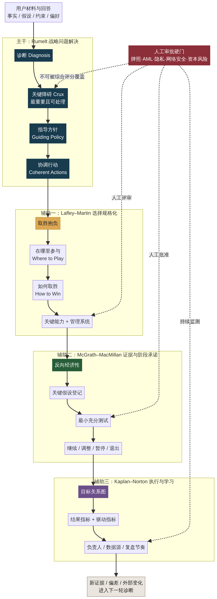

# 2027 Strategy Copilot：权威方法论研究与产品化设计

**作者：Manus AI**  
**日期：2026-09-07**

## 一、先回答你的核心问题

**可以，而且应该这样做。** 这个工具需要让用户知道，它不是让通用 AI 临时“编一份战略”，而是用一套有出处、有结构、有边界的管理方法来组织问题、检查答案和生成报告。

但对外不能写成：

> “这个 AI 训练自某某战略名著。”

除非模型确实使用了获得授权的书籍全文进行训练或检索，否则这种说法既不准确，也会带来版权和信誉风险。Harvard Business Publishing 明确表示，未经书面许可，不得将其内容用于训练或输入生成式 AI／大语言模型。[1]

更准确、也更专业的表达是：

> **本工具采用自主设计的战略分析流程，并参考 Richard Rumelt、A.G. Lafley、Roger L. Martin、Rita Gunther McGrath、Ian C. MacMillan、Robert S. Kaplan 与 David P. Norton 公开发表的战略思想。AI 根据用户提供的事实与假设，依照这套原创结构进行提问、分析和一致性检查。**

也就是说，用户应当理解三件事：

1. **模型能力**来自所使用的通用大语言模型；
2. **方法论纪律**来自我们明确编写的框架、问题树、判断规则和输出 schema；
3. **战略事实**来自用户的数据、经授权的公司材料以及带来源的外部研究。

这比“训练自一本书”更可信，因为它能说清楚系统究竟如何工作。

---

## 二、研究范围与结论

本次比较了八套常见的战略和经营方法：

| 方法 | 代表作者／作品 | 最擅长解决的问题 | 是否适合作主干 |
|---|---|---|---|
| Good Strategy/Bad Strategy + The Crux | Richard P. Rumelt | 诊断真正挑战，找到最关键且可处理的障碍，形成连贯行动 | **最适合** |
| Playing to Win | A.G. Lafley、Roger L. Martin | 把战略具体化为一组相互关联的选择 | 很适合作辅助层 |
| Discovery-Driven Planning | Rita McGrath、Ian MacMillan | 在高度不确定时管理假设、测试和阶段投资 | 很适合作辅助层 |
| Balanced Scorecard / Strategy Maps | Robert Kaplan、David Norton | 把战略连接到结果、驱动指标和执行机制 | 很适合作辅助层 |
| Competitive Strategy / What Is Strategy? | Michael Porter | 产业结构、竞争定位、取舍与活动匹配 | 适合作按需分析镜头 |
| Blue Ocean Strategy | W. Chan Kim、Renée Mauborgne | 非顾客、价值创新和新市场机会 | 适合机会探索，不宜作总框架 |
| OKR / Measure What Matters | Andy Grove、John Doerr | 目标聚焦、透明对齐与周期跟踪 | 适合作执行工具，不是战略形成方法 |
| Leading Change | John Kotter | 组织动员、变革采用与文化嵌入 | 适合作后续变革管理模块 |

### 最终建议

以 **Richard Rumelt 的《Good Strategy/Bad Strategy》与《The Crux》作为唯一主框架**。

Rumelt 的核心观点非常适合 AI 产品：好的战略不是一组宏大目标，而是对真实挑战的理解，以及针对该挑战形成的一组连贯行动。他强调，战略是一种问题解决；领导者应聚焦于最可能带来“可实现进展”的路径，并保持行动和政策彼此一致。[2] [3]

这可以直接克制生成式 AI 最常见的三个问题：

- 把流畅的愿景文字当成战略；
- 把很长的建议清单当成优先级；
- 把彼此争夺资源的项目包装成“完整路线图”。

> **因此，Copilot 的第一责任不是给答案，而是确认用户是否在解决正确的问题。**

---

## 三、推荐的四层方法论

建议把你自己的方法命名为：

# **明策证据环 MingCe Evidence Loop**

副标题：**问题先行 · 选择成链 · 证据过门 · 人类定责**

这个名称是你自己的产品方法名，而不是把别人的书名放进品牌。正式商业使用前仍建议进行目标市场的商标和域名检索。

### 第一层：问题定义与战略判断

**理论来源：Richard Rumelt**

| 结构 | 工具中的作用 |
|---|---|
| Diagnosis | 区分症状和真正挑战；形成多个可被推翻的候选诊断 |
| The Crux | 判断哪个障碍既重要、当前又可处理 |
| Guiding Policy | 形成少量、方向不同的总体应对方案 |
| Coherent Actions | 检查行动是否互相加强，是否真正回应诊断 |

Rumelt 的作者页面将好战略描述为“由论证支持的连贯行动”，并指出坏战略往往来自回避困难选择，或领导者不愿解释真正面对的挑战。[3]

这层拥有整个工具的主导逻辑。其他框架只能帮助它进一步具体化，不能反过来替代诊断。

### 第二层：战略选择规格化

**理论来源：A.G. Lafley 与 Roger L. Martin，《Playing to Win》**

当关键障碍和指导方针已经形成后，再用五项相互关联的选择做压力测试：

1. Winning aspiration；
2. Where to play；
3. How to win；
4. Must-have capabilities；
5. Enabling management systems。

Roger Martin 将战略定义为一组相互关联的选择，并强调 Where to Play 和 How to Win 必须形成匹配关系。[4]

这一层特别适合回答：

- 2027 年我们到底在哪些业务、客户、体验或能力上投入？
- 哪些事情明确不做？
- 我们凭什么胜出或创造独特价值？
- 这个方案需要哪些真实能力和管理系统？

### 第三层：证据与阶段投资

**理论来源：Rita Gunther McGrath 与 Ian C. MacMillan，Discovery-Driven Planning**

对于 AI、数据平台、客户体验创新、核心系统重建等高度不确定事项，不应直接生成一个三年确定性路线图，而应形成：

- 反向经济性：要让这件事值得做，哪些业务结果必须成立？
- 关键假设登记册；
- 最小充分测试；
- 阶段性投资门；
- Continue / Adjust / Pause / Exit 规则。

Discovery-Driven Planning 的原始文章要求通过反向损益、运营规格、关键假设清单和里程碑规划，把隐含假设暴露出来，并在证据不足时推迟重大资源承诺。[5]

### 第四层：执行与学习闭环

**理论来源：Robert Kaplan 与 David Norton，Balanced Scorecard / Strategy Maps**

战略选择批准以后，再连接：

- 客户或利益相关者结果；
- 关键业务流程；
- 数据、技术、人才与组织能力；
- 财务或使命结果；
- 领先指标、滞后指标、负责人和复盘节奏。

Kaplan 与 Norton 的原始论文指出，管理者的衡量体系会影响组织行为，而只看传统财务指标不足以引导持续改进和创新。[6]

这里要注意：Strategy Map 上的因果关系只是**待验证的管理假设**，不是 AI 画出来以后就成为事实。

---

## 四、为什么不是直接选一本书照着做

只用一本书，看起来更“纯”，但对产品并不完整。

| 如果只用…… | 会出现的问题 |
|---|---|
| Rumelt | 能找到问题和形成连贯方案，但缺少固定的选择表达、假设验证和指标系统 |
| Playing to Win | 容易在没有确认真正问题之前，就把五个框填得很漂亮 |
| Balanced Scorecard | 容易先做 KPI，再倒推一个似乎合理的战略 |
| OKR | 能管理执行，却不能判断执行的事情是否战略上正确 |
| Porter | 对竞争定位很强，但不能覆盖集团组合、技术治理和 IR 的多重监管环境 |
| Blue Ocean | 能启发机会，却不能证明新需求、技术可行性和合规性 |
| Kotter | 能推动已决定的变革，但不能判断变革方向本身是否正确 |

所以最合理的方式不是“框架拼盘”，而是一个明确的主从关系：

> **Rumelt 决定问题是什么；Playing to Win 把选择说清楚；Discovery-Driven Planning 决定下一步需要什么证据；Balanced Scorecard 负责执行与复盘。**

---

## 五、把方法论变成用户看得见的信任

### 5.1 Landing Page 短版信誉文案

> **建立在成熟战略思想之上，而不是通用 AI 模板。**  
> 这套独立设计的方法以 Richard Rumelt 的问题诊断思想为主干，并参考 Lafley–Martin 的战略选择、McGrath–MacMillan 的假设验证，以及 Kaplan–Norton 的战略执行方法。AI 帮助你形成和检验候选答案；最终选择和责任始终属于你和你的管理团队。

### 5.2 “About the Method” 完整文案

> **关于明策证据环**
>
> 明策证据环是为 CTO、Integrated Resort 领导团队和 executive learning 场景设计的独立战略决策方法。它把一次高管讨论组织成一条可审计的证据链：我们在解决什么关键障碍，准备作出哪些选择，什么必须为真，哪些证据足以支持下一阶段投入，以及何时应当调整或停止。
>
> Copilot 负责整理材料、提出候选解释、暴露冲突和生成决策草案；拥有授权的人类负责人保留战略、资本、技术、牌照、合规和风险决定权。
>
> 本方法受 Richard P. Rumelt 的战略问题解决思想启发，并参考 A.G. Lafley 与 Roger L. Martin 的战略选择结构、Rita Gunther McGrath 与 Ian C. MacMillan 的 Discovery-Driven Planning 原则，以及 Robert S. Kaplan 与 David P. Norton 的 Balanced Scorecard 与 Strategy Maps 思想。
>
> 本产品是独立设计，并非上述作者、Harvard、Harvard Business Review、Harvard Business Publishing 或其他相关机构的官方产品、认证项目或背书。相关框架用于组织提问、比较方案和管理学习，不构成业绩保证。

### 5.3 报告页方法标签

每份报告首页可以显示：

> **Method: MingCe Evidence Loop v1.0**  
> Diagnosis → Strategic Choices → Evidence Gates → Execution Learning  
> Inspired by published strategy work from Rumelt; Lafley & Martin; McGrath & MacMillan; Kaplan & Norton. Independent implementation; no affiliation or endorsement.

### 5.4 Trust Center 应公开的内容

| 模块 | 应展示什么 |
|---|---|
| Method & Sources | 方法版本、四层逻辑、作者与一手来源链接 |
| How AI Is Used | AI 做提问、候选诊断、一致性检查和报告生成；不作最终批准 |
| Data Provenance | 每项事实的来源、日期和适用范围；无来源内容标记为假设 |
| Human Decision Rights | 哪些事项必须由业务、财务、法务、合规或技术负责人批准 |
| Privacy & Retention | 收集什么、为何收集、保存多久、如何删除 |
| Known Limitations | AI 可能遗漏证据、误判因果或放大用户偏见 |
| Version History | Prompt、规则、模型和报告 schema 的版本变更 |

真正建立 reputation 的不是列出四本书，而是让用户看到：**这个系统有方法、有出处、有边界，也知道什么时候不能替人作决定。**

---

## 六、升级后的核心访谈

第一版不应向用户展示 13 个“学术步骤”，而应压缩成 **8 个自然问题**，后台再用四层方法进行分析。

| 用户看到的问题 | 后台方法 | 质量检查 |
|---|---|---|
| 1. 这次你真正需要作出什么决定？最迟何时？谁拥有最终决定权？ | 治理边界 | 必须有明确决策、范围、期限和 owner |
| 2. 发生了什么，让这个决定现在变得重要？哪些是事实，哪些只是判断？ | Rumelt Diagnosis | 区分事实、假设、偏好和未知 |
| 3. 如果到 2027 年底取得实质进展，最重要的结果是什么？ | The Crux | 不能只是口号或项目上线 |
| 4. 真正阻碍这个结果的机制是什么？还有哪些不同解释？ | Rumelt Diagnosis | 至少两个候选诊断，并要求反证 |
| 5. 如果资源不增加，哪个障碍最值得优先解决？哪些重要事项本轮不处理？ | The Crux | 同时检验影响、可处理性和时间窗口 |
| 6. 有哪些真正不同的应对路径？各自选择在哪里投入、如何创造优势、放弃什么？ | Rumelt + Playing to Win | 至少两条方案；Where to Play 与 How to Win 成对 |
| 7. 要让首选方案成立，哪些能力、经济条件和关键假设必须为真？ | Playing to Win + DDP | 能力差距、经济性和假设均有证据状态 |
| 8. 未来 90 天最小的行动和验证是什么？什么结果会让你继续、调整或停止？ | DDP + Balanced Scorecard | 有负责人、指标、阈值、数据源和复盘日期 |

AI 只在以下情况下追加追问：没有做取舍、缺少证据、回答内部冲突、指标只是活动量、关键假设不可验证，或者用户忽略了明显的风险硬门。

---

## 七、升级后的报告结构

| 报告章节 | 方法论来源 | 交付内容 |
|---|---|---|
| 1. Decision Brief | 自主治理层 | 决策事项、范围、时限、批准人和硬约束 |
| 2. Evidence Base | Rumelt | 事实、来源、假设、冲突证据和未知项 |
| 3. Challenge Diagnosis | Rumelt | 症状、候选诊断、反证和管理层确认的诊断 |
| 4. The Crux | Rumelt | 最关键且可处理的障碍，以及为什么现在优先 |
| 5. Strategic Alternatives | Rumelt | 至少两条不同的指导方针及其取舍 |
| 6. Choice Contract | Playing to Win | Where to Play、How to Win、能力和管理系统 |
| 7. Assumption & Economics Register | DDP | 反向经济性、关键假设和证据状态 |
| 8. Evidence Gates | DDP | 测试、阈值、预算和 Continue / Adjust / Pause / Exit |
| 9. Coherent Action Portfolio | Rumelt | 相互强化的行动，以及 Stop / Defer List |
| 10. Execution Evidence Map | Balanced Scorecard | 结果指标、驱动指标、数据源、owner 和复盘节奏 |
| 11. Risk & Expert Review | 自主治理层 | IR 与 IT 必须经过的法务、合规、安全和资本审查 |
| 12. Decision Record | 自主治理层 | 最终决定、异议、人工修改和重审触发器 |

这会让最终报告不仅“像咨询报告”，而且能够解释：

- 为什么这是关键问题；
- 为什么选择这条路径；
- 需要相信哪些假设；
- 下一笔投入之前需要什么证据；
- 谁承担最终责任。

---

## 八、Integrated Resort 与 CTO 的专业覆盖

经典战略书不会覆盖 IR 所有实际风险。因此，产品必须增加一层不能被 AI 综合评分覆盖的 **Human Approval Gates**：

- 博彩牌照与监管义务；
- AML / KYC 与制裁风险；
- 负责任博彩；
- 宾客、会员和员工数据隐私；
- 网络安全、业务连续性与事件响应；
- AI 模型风险、数据治理与第三方供应商；
- 大型资本项目和不可逆承诺；
- 宾客与员工人身安全；
- 劳工、社区和声誉影响。

这些不是普通“风险分数”。只要触发，就应在报告中显示：

> **Requires named human review before decision or execution.**

这会提升产品在 CTO 和 IR 场景中的专业可信度，也能避免用户把 AI 建议误解为批准或合规意见。

---

## 九、版权、品牌和表达边界

### 可以做

- 准确引用作者、书名、年份和公开来源；
- 用自己的语言概括思想；
- 编写原创问题、判断规则、数据结构和页面设计；
- 清楚说明“参考”“受启发于”“独立实现”；
- 链接到作者、出版社或原始论文页面。

### 不建议做

- 声称“AI 训练自这些书”；
- 使用书籍全文、付费文章、原版图表或工具包作为 Prompt、RAG 或训练资料；
- 把产品叫作 “Official Playing to Win Copilot”“HBR Strategy Copilot”或类似名称；
- 使用 Harvard、HBR、作者或出版社的 logo；
- 暗示获得作者、大学或出版方的认证和背书；
- 把出版案例的成功结果当作产品效果证明。

如果未来希望直接使用原书工作表、图示、章节摘录或课程内容，需要向相应权利人申请书面许可。现阶段完全没有必要这样做：**抽象方法原则 + 自己的原创问题与输出结构，已经足够形成可信且有差异化的产品。**

---

## 十、建议的验证方式

不要在产品一上线就写“科学验证”。先进行一个 6 个真实决策案例的小型 pilot：

| 样本 | 数量 | 示例 |
|---|---:|---|
| CTO / IT | 2 | AI 投资、核心系统现代化或 cyber resilience |
| Integrated Resort 跨职能 | 2 | 宾客体验、数据平台或资本与运营协同 |
| EMBA executive | 2 | 增长选择、组织能力或新业务机会 |

让每组先用现有方式形成一份决策 memo，再使用 Copilot 做同一问题。由三名不参与产品设计的评审者，比较以下九项：

1. 诊断是否具体；
2. 关键障碍是否可处理；
3. 是否存在真正不同的方案；
4. 是否做出明确取舍；
5. 证据是否可追溯；
6. 关键假设是否完整；
7. 行动是否连贯；
8. 风险硬门是否完整；
9. 最终责任是否清晰。

同时进行“幻觉和治理红队”：故意放入过时日期、相互矛盾的数据、无来源断言，以及要求 AI 越过合规或安全审批的提示。

建议的内部通过门槛是：

- 九个维度中至少七项的中位数提高 1 分；
- 关键事实可追溯率达到 95% 以上；
- 无来源关键主张全部标记为假设或待验证；
- 所有硬性合规和安全要求均升级到具名人工审批；
- 不出现虚构引用或 AI 自动批准重大决策。

这是流程和可用性验证，不是长期业绩因果证明。对外只能写成：

> “在小样本决策流程测试中观察到……”

不能写成：

> “已证明能提高企业绩效。”

---

## 十一、最终产品主张

升级后，工具的主张可以从：

> AI 帮你生成一份 2027 Strategy Plan。

变成：

> **AI 不替你做战略决定。它帮助你找到真正的问题、看清必须做出的选择、明确仍待验证的假设，并把每一步变成可审议、可追溯的管理决策。**

这比简单列出一本名著更有 reputation，因为它同时具备：

- **权威来源**；
- **清楚的主从方法结构**；
- **原创的产品化实现**；
- **证据和人工决策边界**；
- **可验证而不过度承诺的价值主张**。

---

## References

[1]: https://hbsp.harvard.edu/copyright-permission/ "Harvard Business Publishing — Copyright Permission"
[2]: https://www.richardrumelt.com/the-crux.html "Richard Rumelt — The Crux"
[3]: https://www.richardrumelt.com/good-strategy-bad-strategy.html "Richard Rumelt — Good Strategy Bad Strategy"
[4]: https://rogerlmartin.com/thought-pillars/strategy "Roger L. Martin — Strategy"
[5]: https://hbr.org/1995/07/discovery-driven-planning "Rita Gunther McGrath and Ian C. MacMillan — Discovery-Driven Planning"
[6]: https://hbr.org/1992/01/the-balanced-scorecard-measures-that-drive-performance-2 "Robert S. Kaplan and David P. Norton — The Balanced Scorecard—Measures that Drive Performance"
[7]: https://www.hbsp.harvard.edu/product/7124BC-PDF-ENG "Harvard Business Publishing — Playing to Win: Introduction, How Strategy Really Works"
[8]: https://www.hbs.edu/ris/Publication%20Files/10-074_0bf3c151-f82b-4592-b885-cdde7f5d97a6.pdf "Robert S. Kaplan — Conceptual Foundations of the Balanced Scorecard"
[9]: https://trademark.harvard.edu/pages/trademark-notice "Harvard Trademark Notice"
